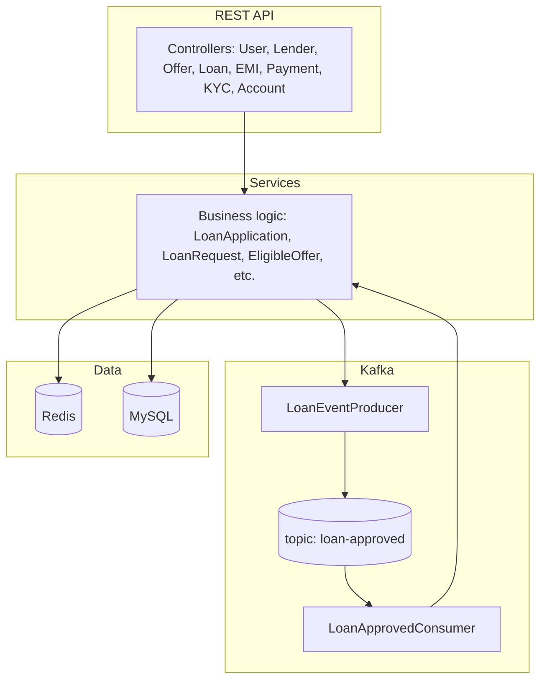
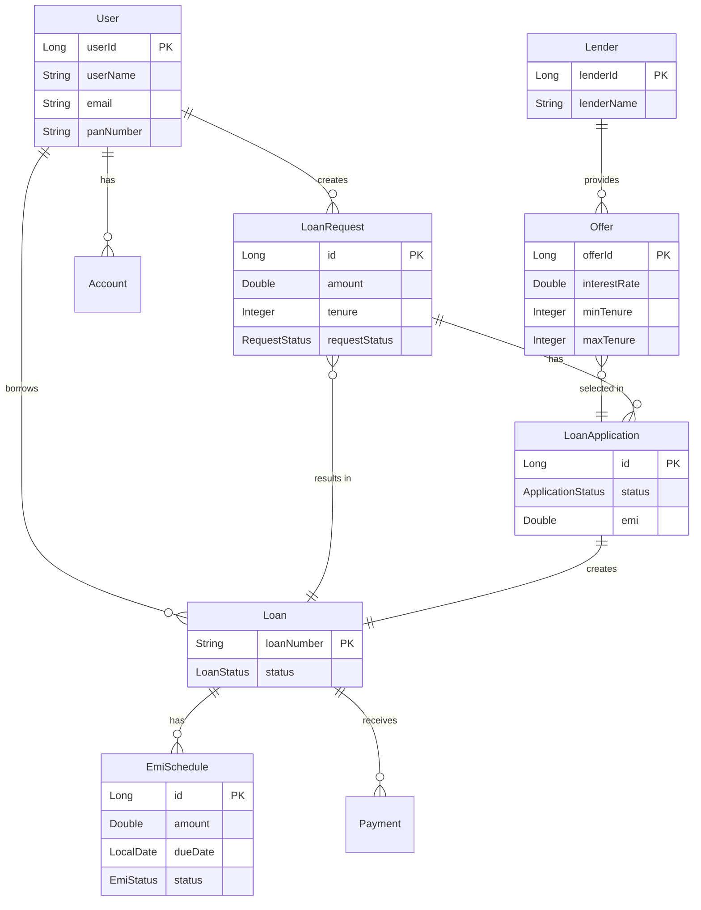
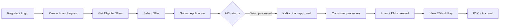
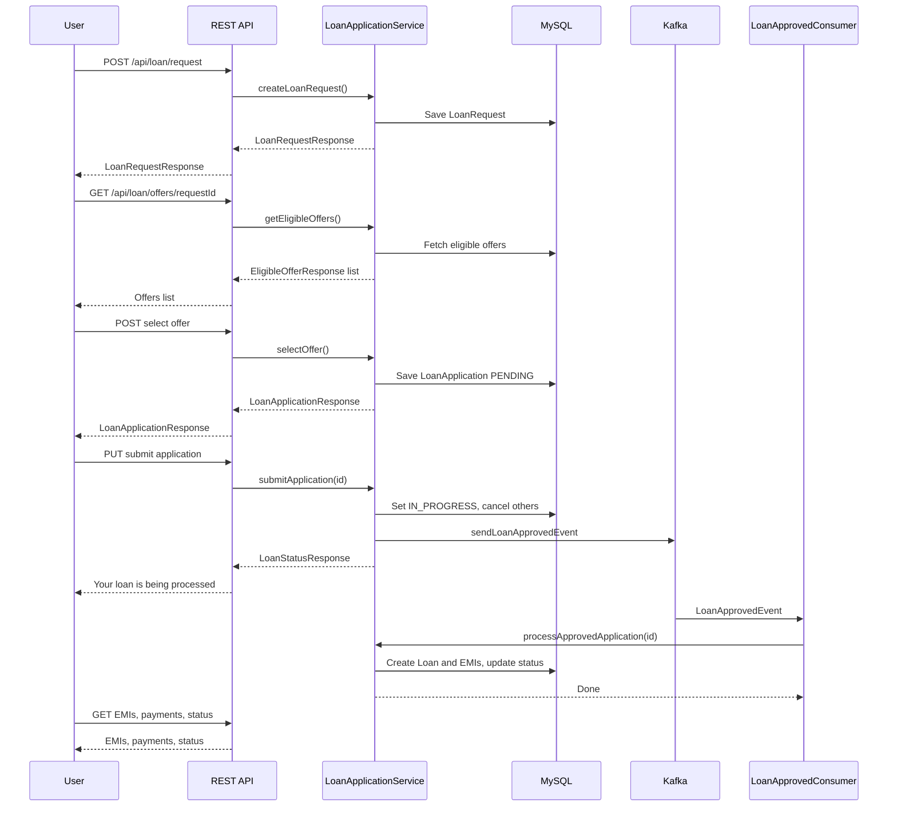

# Loan Booking Application

A full-stack **loan booking system** built with Spring Boot. It supports user onboarding, loan requests, offer selection, asynchronous loan processing via Kafka, EMI management, payments, and KYC verification—with Redis caching for performance.

---

## Features

| Area | Description |
|------|-------------|
| **Users** | User registration and retrieval |
| **Lenders & Offers** | Manage lenders and loan offers (cached in Redis) |
| **Loan Requests** | Create loan requests and fetch eligible offers |
| **Loan Applications** | Apply with an offer, submit application, accept offer (triggers Kafka event) |
| **Async Processing** | Kafka-based flow: accept application → event to `loan-approved` → consumer creates Loan + EMI schedules |
| **EMI** | View EMI schedules and status |
| **Payments** | Record and list payments against loans |
| **KYC** | KYC verification for users |
| **Accounts** | User account management |
| **API Docs** | Swagger UI (SpringDoc OpenAPI) |

---

## Tech Stack

| Category | Technology |
|----------|------------|
| **Runtime** | Java 17 |
| **Framework** | Spring Boot 3.2.x |
| **API** | Spring Web MVC, REST |
| **Persistence** | Spring Data JPA, MySQL |
| **Messaging** | Apache Kafka (Spring Kafka) |
| **Caching** | Redis (Spring Data Redis) |
| **Validation** | Bean Validation (javax.validation) |
| **Docs** | SpringDoc OpenAPI (Swagger UI) |
| **Build** | Maven |

---

## Prerequisites

- **Java 17+**
- **Maven 3.6+**
- **MySQL 8.x** (e.g. `localhost:3306`)
- **Apache Kafka** (e.g. `localhost:9092`)
- **Redis** (e.g. `localhost:6379`)

---

## Quick Start

### 1. Clone the repository

```bash
git clone https://github.com/vishnoiyashraj25/LoanBookingApplication.git
cd LoanBookingApplication
```

### 2. Set up MySQL

Create a database and user (or use your own):

```sql
CREATE DATABASE loan_booking;
-- Use a user with access to this database
```

### 3. Start Kafka (local)

Ensure Kafka is running and the broker is reachable at `localhost:9092`. Create the topic if auto-create is disabled:

```bash
# Example (adjust paths for your Kafka install)
kafka-topics --create --topic loan-approved --bootstrap-server localhost:9092 --partitions 1 --replication-factor 1
```

### 4. Start Redis

Ensure Redis is running on `localhost:6379` (or update configuration accordingly).

### 5. Configure the application

Edit `src/main/resources/application.properties` and set:

- `spring.datasource.url` – JDBC URL for MySQL (e.g. `jdbc:mysql://localhost:3306/loan_booking?useSSL=false&allowPublicKeyRetrieval=true`)
- `spring.datasource.username` – MySQL username
- `spring.datasource.password` – MySQL password

For production or shared setups, prefer environment variables or a profile-specific properties file and **do not commit credentials**.

Optional variables you can override via env or `application.properties`:

| Property | Default | Description |
|----------|---------|-------------|
| `spring.datasource.url` | `jdbc:mysql://localhost:3306/loan_booking?...` | MySQL URL |
| `spring.datasource.username` | `root` | DB username |
| `spring.datasource.password` | - | DB password |
| `spring.kafka.bootstrap-servers` | `localhost:9092` | Kafka broker(s) |
| `spring.data.redis.host` | `localhost` | Redis host |
| `spring.data.redis.port` | `6379` | Redis port |
| `kafka.topic.loan-approved` | `loan-approved` | Topic for approved-loan events |
| `kafka.group.loan-group` | `loan-group` | Consumer group |

### 6. Build and run

```bash
mvn clean install
mvn spring-boot:run
```

The API will be available at `http://localhost:8080` (or the port you configure).

### 7. API documentation

Once the application is running, open Swagger UI:

- **Swagger UI:** `http://localhost:8080/swagger-ui.html`

---

## Diagrams

### 1. High-level architecture (components & flow)



### 2. Entity relationship (core domain)



### 3. User flow (loan booking journey)



**Detailed user flow (step-by-step):**



---

## Project Structure (high level)

```
src/main/java/com/project/LoanBookingApplication/
├── LoanBookingApplication.java    # Main class, @EnableKafka
├── config/                        # Kafka, Redis, cache config
├── controller/                    # REST controllers (users, lenders, offers, loan, EMI, payment, KYC, account)
├── dto/                           # Request/response DTOs
├── entity/                        # JPA entities
├── enums/                         # Status and type enums
├── exception/                     # Global exception handler, custom exceptions
├── kafka/
│   ├── Producer/                  # LoanEventProducer (loan-approved events)
│   └── Consumer/                  # LoanApprovedConsumer
├── repository/                    # Spring Data JPA repositories
├── service/                       # Business logic
└── util/                          # Helpers (e.g. EMI calculator)
```

---

## Kafka flow (summary)

1. User selects an offer and application is accepted via API.
2. Service updates DB (e.g. request status IN_PROCESS) and publishes a **LoanApprovedEvent** to the topic **`loan-approved`**.
3. **LoanApprovedConsumer** (group: `loan-group`) consumes the event and calls the service to create the **Loan** and **EMI** schedules and update statuses.

Failed messages can be sent to the Dead Letter Topic **`loan-approved.DLT`** (see `docs/KAFKA_REVIEW_QA.md`).

---
